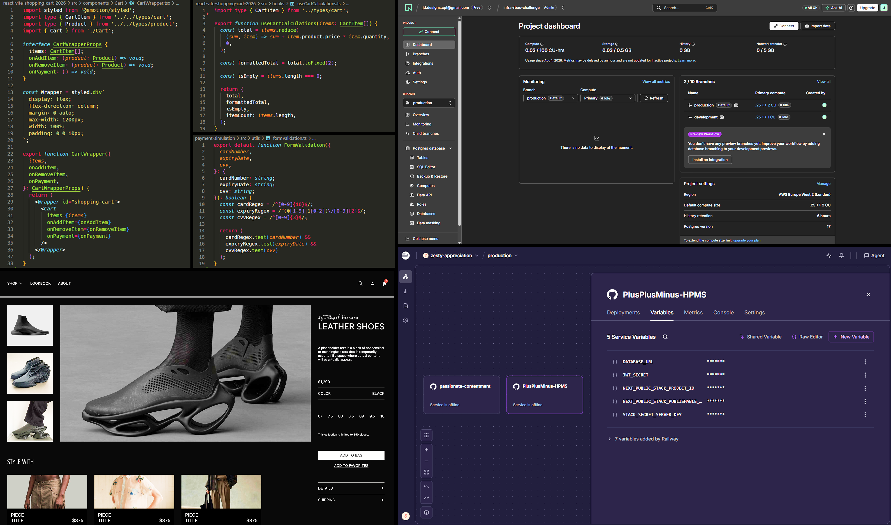

### Full-Stack Web Developer

I specialize in (React + TypeScript) with a strong focus on building complex scalable UI. Working within Agile teams, I contribute in daily stand-ups and deliver code iteratively through sprint cycles, moving features from development to QA and then into production. I promote the use of reusable component libraries to enforce consistency, and take ownership of design decisions to ensure end-to-end product quality. I prioritize reusability to help teams deliver efficiently. I also value knowledge-sharing and continuous learning within collaborative environments. 12+ years of experience designing and developing web applications in consultancy and product environments.

 

 

 

  

